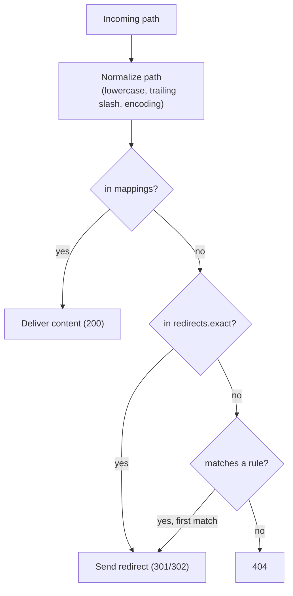

# ID-ending URLs

Modern CMS systems generate URLs that fulfill two functions: On the one hand, they are readable and descriptive for people, and on the other hand, they are uniquely identifiable for the system. The concept combines a descriptive title (slug) with a unique identification number (ID) at the end of the URL.

A typical URL follows this pattern: `/speaking-path/speaking-title-127`. The slug describes the content clearly, while the number at the end represents the unique ID of the data record. When a user calls up this URL, the ID is extracted and loads the correct data record via it.

The system can always reliably retrieve the correct data record, regardless of whether the slug was entered exactly or not. This makes content management considerably more flexible. If the URL has been changed, a redirect can be used to redirect to the new URL without invalidating the old URL. Content can therefore be easily updated and renamed without breaking existing links.

Speaking URLs are self-explanatory and user-friendly. The slug contains relevant keywords that search engines recognize.

## Translated URLs (RTL languages)

Like the website itself, its URLs are also automatically translated by the CMS. For Arabic pages, for example, this can result in the ID suffix not being on the far right but on the left. The reason for this is the ["Unicode Bidirectional Algorithm"](https://www.unicode.org/reports/tr9/). With UTF-8 characters, this ensures that the characters are displayed in the correct order. This means that the ID is always at the end of the URL, but is displayed either on the left or right depending on the language. An example of an Arabic URL could look like this:

`/مسار-تحدث-عن-الطبيعة-127`

A translated URL can also consist of Arabic and non-Arabic characters. Depending on where the non-Arabic characters are in the text, the ID may also be displayed on the right.

`/مسار_المشي/التحدث_عن_الطبيعة-vi/vii-123`

## Site Manifest

The ID-ending URLs described above are resolved at request time by the delivery layer. The information needed for this resolution is not queried live against the editorial database on every request – that would be too slow and would couple the public website to the authoring system. Instead, publishing produces a **compiled artifact**: the _Site Manifest_.

The Site Manifest is a generated, read-optimized file (in the PHP delivery context a `manifest.php`) that the website loads to map an incoming path to its target. It is the bridge between the authoring world (where content, slugs and redirects are edited) and the delivery world (where a path has to be resolved as fast as possible).

### Structure of the manifest

```php
<?php return [
   // Resolved system routes
   "home" => 1118,
   "errors" => [
      "401" => 1140,
      "404" => 1138,
      "403" => 1139,
      "500" => 1136,
      "410" => 1137
   ],

   // Exact paths -> mapping entry (deliver content, HTTP 200)
   "mappings" => [
      "/robots.txt" => [
         "id"   => 1131,
         "mode" => "FORWARD"
      ],
      "/kultur" => [
         "id"     => 16711,
         "mode"   => "FORWARD",
         "locale" => "en_US"
      ],
      "/microsite/sitepark/robots.txt" => [
         "id"   => 40509,
         "mode" => "FORWARD"
      ]
   ],

   // Centrally managed redirects
   "redirects" => [

      // Exact redirects -> hash lookup, O(1)
      "exact" => [
         "/old-campaign" => ["mode" => "REDIRECT_PERMANENT", "type" => "path",    "target" => "/new-campaign"],
         "/shop"         => ["mode" => "REDIRECT_TEMPORARY", "type" => "url",     "target" => "https://shop.example.com"],
         "/info"         => ["mode" => "REDIRECT_PERMANENT", "type" => "article", "target" => 16711]
      ],

      // Rule-based redirects -> ORDERED list, "first match wins"
      "rules" => [
         ["mode" => "REDIRECT_PERMANENT", "match" => "^/blog/(\\d+)$", "type" => "path", "target" => "/article/$1"],
         ["mode" => "REDIRECT_PERMANENT", "match" => "^/old/(.*)$",    "type" => "path", "target" => "/new/$1"],
         ["mode" => "REDIRECT_TEMPORARY", "match" => "^/partner/.*$",  "type" => "url",  "target" => "https://partner.example.com"]
      ]
   ]
];
```

The sections serve distinct purposes:

- **`home`** – the article ID that serves the site root.
- **`errors`** – the article IDs that render the standard HTTP error pages.
- **`mappings`** – the exact path-to-content mappings. This is where the ID-ending URLs land: the slug-and-ID path is reduced to a stable key that points to a mapping entry. Delivering one of these means returning the content with HTTP 200. Each entry is an object describing the target:
  - **`id`** – the article ID of the data record to deliver.
  - **`mode`** – how the target is delivered. For content mappings this is `FORWARD` (serve directly, HTTP 200); see [Modes](#modes-the-shared-status-vocabulary) for the full vocabulary.
  - **`locale`** _(optional)_ – the locale the content is delivered in (e.g. `en_US`), used for translated URLs. When omitted, the publication's default locale applies.
- **`redirects`** – centrally managed redirects that do not deliver content but send an HTTP redirect (301/302/…) to a new destination.

### Two lookup mechanisms: exact vs. rule-based

The manifest deliberately keeps two structurally different kinds of entries apart, because they require different evaluation:

|            | Exact entries (`mappings`, `redirects.exact`) | Rule-based entries (`redirects.rules`) |
| ---------- | --------------------------------------------- | -------------------------------------- |
| Matching   | exact key                                     | pattern / regex                        |
| Evaluation | hash lookup, O(1)                             | sequential, _first match wins_         |
| Order      | irrelevant                                    | **decisive**                           |
| Target     | mapping entry (`mappings`) / typed target (`redirects.exact`) | path, article or external URL          |
| Origin     | article publishing (owner)                    | centrally managed (no owner)           |

Exact entries are a hash map: _“does this path exist? → target”_, independent of order. Rule-based entries must be evaluated in a defined order, because the first matching rule wins. Mixing them would force the fast exact case through the expensive sequential evaluation, so the manifest keeps the ordered regex list as small as possible and routes everything that can be an exact key into the hash sections.

### Modes – the shared status vocabulary

Every manifest entry – a content mapping as well as a redirect – carries a **`mode`**. The mode is a single enum that expresses both _what_ should happen and _which HTTP status_ to send, so there is no separate `status` field. Its backing value is the HTTP status code itself:

| Mode                               | HTTP | Meaning                                                                    |
| ---------------------------------- | ---- | -------------------------------------------------------------------------- |
| `FORWARD`                          | 200  | Alias – content is resolved internally and served directly (no redirect).  |
| `REDIRECT_PERMANENT`               | 301  | Permanent redirect – the URL has moved, SEO value is passed on.            |
| `REDIRECT_TEMPORARY`               | 302  | Temporary redirect – target may change again, no SEO transfer.             |
| `REDIRECT_TEMPORARY_PRESERVE_METHOD` | 307 | Temporary redirect that preserves the HTTP method and body (POST stays POST). |
| `REDIRECT_PERMANENT_PRESERVE_METHOD` | 308 | Permanent redirect that preserves the HTTP method and body.                |

This is why content mappings and redirects share the same shape: `FORWARD` is simply the mode that delivers content instead of redirecting. The distinction "deliver vs. redirect" is `FORWARD` vs. any of the `REDIRECT_*` modes; the `301/302/…` nuance is the chosen redirect mode.

### Typed redirect targets

Both `redirects.exact` and `redirects.rules` describe their target with two fields:

- **`type`** – the target discriminator: `path` (an internal path), `article` (an article ID, resolved like any other mapping) or `url` (an external absolute URL).
- **`mode`** – the redirect mode to apply (`REDIRECT_PERMANENT`, `REDIRECT_TEMPORARY`, …), which also determines the HTTP status sent. See [Modes](#modes-the-shared-status-vocabulary).

This covers the three redirect cases an editor can configure: redirect to another path, to a specific article, or to an external site.

### Resolution order

Because the manifest exposes several sections, the delivery layer queries them in a defined order. A typical order is:



There is a precedence decision behind this order: what wins if a path is matched by both a content mapping and a redirect rule? The common rule is **content mapping beats generic redirect rule** – existing content is delivered rather than redirected. Cases that need a forced redirect (e.g. a legal or deliberate block that must win over existing content) require an explicit priority/force marker and a different ordering.

### Path normalization belongs to the resolver, not the patterns

The incoming path is **normalized once, centrally, before any lookup** – lowercasing, trailing-slash policy, encoding and collapsing of multiple slashes. This is the same normalization that is applied when entries are written, so that the stored key and the looked-up key always match.

A direct consequence: variants such as a trailing slash must **not** be encoded into individual redirect patterns. A pattern like `^/home/?$` is an exact match in regex disguise; with central normalization `/home/` becomes `/home` _before_ matching, so the entry belongs into the fast `exact` section, not the ordered rule list. The rule of thumb is: only patterns with a real variable, group or alternative (`(\d+)`, `(.*)`, `|`) belong into `redirects.rules`; everything else is an exact key.
