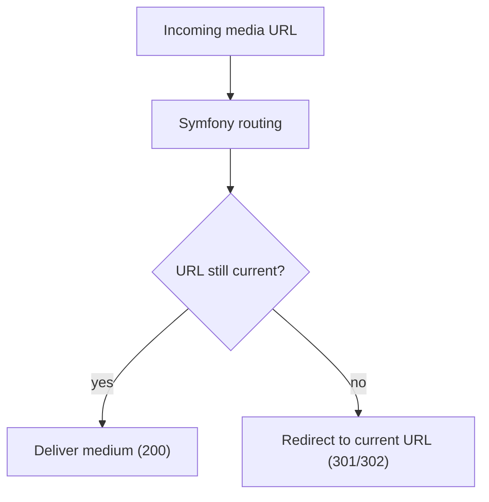

# Media delivery

Media (images, PDFs and other downloads) are delivered via URLs that carry the **stable ID** of the medium inside the path. This follows the same principle as [ID-ending URLs](id-ending-urls.md): the ID never changes, but the descriptive part of the path (the slug) can change over time. Because of this, a media URL is not simply mapped to a file on disk – it is resolved so that an outdated URL can be redirected while the medium itself is always identified by its unchanged ID.

The file-system layout that backs these URLs is described in [Resource channel → Media](resource-channel.md#media).

## Media URL forms

Unlike content URLs, where the ID is appended at the very end, media URLs insert the ID as the last path segment **before** the file name. This keeps the original file name (relevant e.g. for downloads).

### Central media

A medium that is provided centrally in the CMS:

```
/downloads/1165/document.pdf
```

Here `1165` is the ID of the medium and `document.pdf` is the retained file name.

### Embedded media

Media that are uploaded directly to an article (see [embedded media](resource-channel.md#embedded-media)) carry a two-part ID separated by `-`:

```
/pages/sample-page.media/32891-40507/document.pdf
```

The first ID (`32891`) is the ID of the article the medium was uploaded to, the second (`40507`) is the ID of the medium.

#### Special case: homepage

Embedded media of the homepage are a special case, because the homepage has no slug path – it is reachable under `/`. The URL therefore starts with `/home.media/`:

```
/home.media/{homeId}-{mediaId}/<file-name>
```

The `{homeId}` refers to the `home` entry in the [manifest](id-ending-urls.md#site-manifest).

### Scaled image variants

If the medium is an image, there can be scaled variants of it. The variant is addressed by a `.scaled` suffix on the file name followed by a hash:

```
/images/1163/picture.jpg.scaled/fb0918db219ac3539f2c82e83665a235.jpg
```

For an image that was uploaded directly to an article, a scaled variant looks like this:

```
/pages/sample-page.media/1217-1299/picture.jpg.scaled/6f2211004732b4bb920012eef39a437d.jpg
```

### Temporary media (preview)

For the preview function there are temporary URLs for media. This mainly concerns embedded media. The two-part ID is `{tmp-counter}-{mediaId}` (see [temporary resources](resource-channel.md#temporary-resources)):

```
/pages/tmp-1.media/1-1299/picture.jpg
```

And for the scaled variant:

```
/pages/tmp-1.media/1-1299/picture.jpg.scaled/6f2211004732b4bb920012eef39a437d.jpg
```

## Resolution via Symfony routing

Because a media URL can change (the slug), it cannot be delivered directly by Apache in the general case: it must be checked whether the requested URL is still current. These requests therefore first go through the Symfony routing:



This way an old variant of a URL – one that has changed in the meantime – is redirected to the current URL, while a current URL delivers the medium directly.

## Bypass for direct delivery

Routing every media request through Symfony is not ideal for performance when a page contains many images. The bypass is therefore intended for images embedded within a page, so that not every image has to be delivered through Symfony. The technique works for all media but is only used for images.

Bypass URLs start with the `/_media/` prefix and address the medium via the **object ID scheme** (the ID split into three-digit groups, padded with `0`, as used for [resource objects](resource-channel.md#objects)). The descriptive file name is replaced by `{id}.{ext}`.

A medium then has the following URL:

```
/_media/000/001/163.jpg
```

Scaled variants of images:

```
/_media/000/001/163.jpg.scaled/fb0918db219ac3539f2c82e83665a235.jpg
```

Embedded media:

```
/_media/000/001/217.media/1299.jpg
```

Scaled variants of embedded images:

```
/_media/000/001/217.media/1299.jpg.scaled/fb0918db219ac3539f2c82e83665a235.jpg
```

For the preview function there are also bypass URLs for temporary (embedded) media:

```
/_media/tmp/001.media/1299.jpg
```

And for the scaled variant:

```
/_media/tmp/001.media/1299.jpg.scaled/6f2211004732b4bb920012eef39a437d.jpg
```

Embedded media of the homepage follow the same object ID scheme via the `home` ID.

### SEO: exclude the bypass from crawlers

A bypass URL is a **second URL for the same resource** (the medium is also reachable via its regular speaking URL). This duplicate is not SEO-compliant. Everything below `/_media/*` must therefore be excluded from crawlers in the `robots.txt`:

```
User-agent: *
Disallow: /_media/
```

!!! note
    The exact Apache rewrite mapping from a `/_media/...` request to the file on disk is not documented here and should be verified against the implementation.

!!! note
    In [extranet mode](extranet.md) the bypass is disabled: all requests to public media must be delivered via PHP/Symfony instead of directly by the web server.
