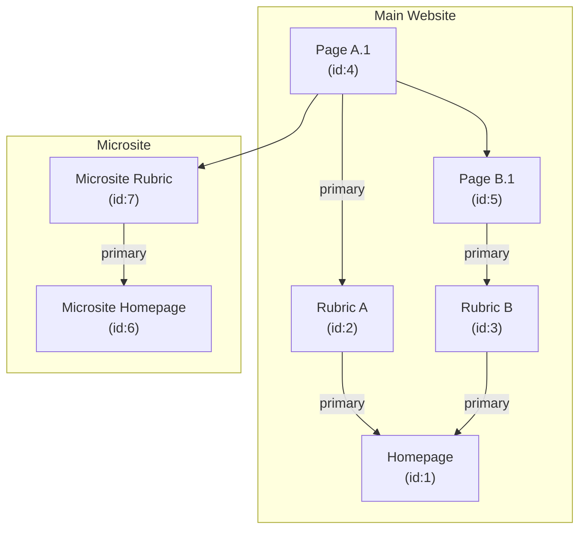

# Navigation

The navigation of a website is a central interface element. It enables structured access to pages and content and depicts the information architecture logically and visually. In this way, it helps users to find their way around the application efficiently.

In Atoolo, navigation has a special meaning: it not only maps the page structure, but can also influence the behavior of pages or teasers - depending on how they are arranged in the navigation.

Each resource knows its direct superordinate and subordinate resources. The top elements of the navigation hierarchy - so-called root elements or homepages - are specially marked.

A resource can be attached to several nodes in the navigation hierarchy. However, there must be no circularity. This means that a resource can have several higher-level resources - even from different hierarchies, i.e. below different homepages.

The associated homepage of a resource is determined by following the link upwards. If there are several higher-level resources, one of them is marked as the _primary link_. This results in the _primary path_ of the resource.

Some properties of the website - such as theming information, header or footer - are stored on the homepage resource. This information is determined by identifying the associated homepage and reading its data. For example, the primary color of a page can be controlled centrally.

This principle can be extended: Information can be stored not only directly on the homepage, but also on another resource within the navigation path. For example, a special header or footer can be configured on a rubric page. The current page then scrolls up the navigation path until the information is found. This allows data to be "inherited" recursively via the navigation - e.g. the kicker of a teaser.

The following diagram shows how "Page A.1" is linked in the navigation. There is a primary path (via section A) and two secondary paths (via rubric B and via the microsite section).



## The P parameter

By default, only the primary path of a resource is used. If you want to use a _secondary path_ instead, this must be specified explicitly - via the so-called **P parameter**.

The P parameter (P stands for _path_) is a URL parameter that specifies the IDs of the resources in the navigation path, comma-separated from the homepage ID to the target resource:

```
?p=1,3,5,4
```

In the above example, there are two alternative paths to "Page A.1":

- `?p=1,3,5,4`: Secondary path via "Page B.1" within the main website
- `?p=6,7,4`: Secondary path via the microsite rubric

Only valid and known paths are accepted.

## P parameter with foreign parent

In some cases, a page should not be displayed under its defined navigation, but below a search page, for example. A typical use case is an event calendar search for a specific area (e.g. "Culture"). In the event of a hit, the target page should appear below the search page - even though they are not linked in the navigation.

The extended **P parameter with external parent** is available for this purpose. The parent node is not specified by ID, but by its _Resource-Location_. The last element remains the ID of the resource to be displayed:

```
?p=1,3,/culture/events-search.php,20
```

To prevent manipulation, this parameter is signed by the PHP backend. A valid link then looks like this, for example:

```
?psig=gec7eqn32dlq1ncg,1,3,/culture/events-search.php,20
```

Only **P -parameters** generated and signed by the PHP backend are accepted for these special cases.
