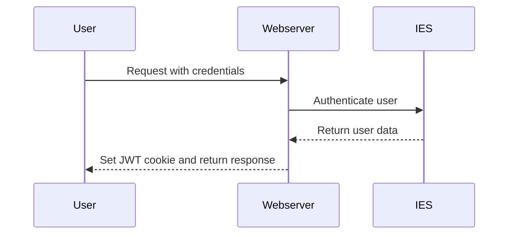
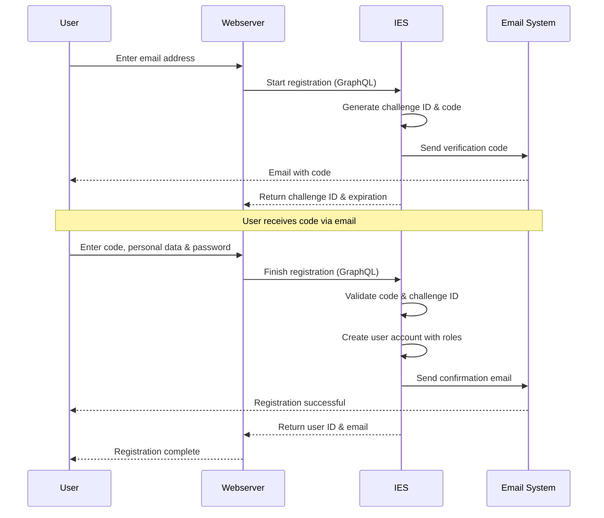
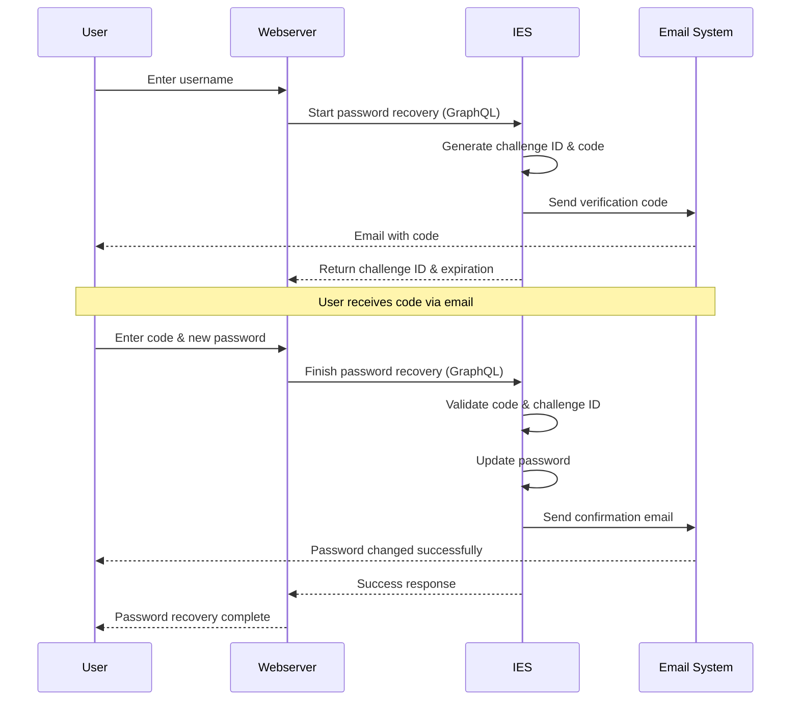

# WebAccount

The WebAccount is a central user account with which users can register and log in to a website. It is used for identification, authorization and personalization within a site.

## Use cases

**Registration & login**: Users can register themselves or be invited by administrators. After registration, extended functions are available.

**Personalized access**: Content and functions of the website are activated individually depending on the authorization level (e.g. only for logged-in users or certain groups).

**Access-restricted areas**: Used for extranet solutions, among other things.

**External content management**: External users can use their WebAccount to maintain events, for example, without requiring internal access to the system administration.

## Authentication

WebAccount users are managed in the IES. If a user wants to authenticate themselves, a request is sent to the web server. The web server does not receive the request and in turn sends a request to the IES to carry out the authentication. The IES checks the access data and returns the user data if authentication is successful. A JWT token containing the user data is then generated on the web server side. This token is stored in a cookie and used for future requests to identify and authenticate the user.

Currently, authentication is only possible via user name and password. Other authentication mechanisms are conceivable and can be implemented depending on the project requirements.

Already implemented authentication mechanisms are:

- **LDAP authentication via the IES**: The IES does not check the user name and password against its user administration but transfers the access data to an LDAP system which carries out the authentication.

Other possible implementations would be:

- **Authentication mechanisms via the IES**: The IES can support various authentication mechanisms.

      - **Username and password authentication with 2FA**: This is an addition to the existing authentication mechanism in which the IES supports two-factor authentication (2FA). The user enters their username and password and must also enter a confirmation code (`TOTP` - Time-based One-Time Password), which is generated via an authentication app.

      - **OpenID Connect via the IES**: OpenID Connect authentication can be set up in the IES, which makes it possible to log in via external identity providers. The IES acts as an OpenID Connect client and forwards the authentication requests to the respective provider. Two scenarios are conceivable for the possible role assignments:

          - **Claims mapping**: Here, the user's claims, which are provided by the external identity provider, are mapped to the roles and authorizations in the IES. This enables fine-grained access control based on the user attributes. In this scenario, it is not necessary for the IES to create the users in the system, as authentication takes place directly via the external identity provider.

          - **Role assignment in the IES**: In this scenario, the roles and authorizations are assigned manually in the IES. The IES receives the authentication information from the external identity provider and assigns the corresponding roles based on the rules defined in the IES. This enables central management of user roles and authorizations in the IES, independent of the external identity providers. In this scenario, it is necessary for the IES to create the users in the system, as authentication takes place directly via the external identity provider.

      - **WebAuthn (Passkeys)**: WebAuthn is an open standard for authentication that allows users to log in securely and user-friendly with biometric data or hardware tokens. The IES can support WebAuthn to provide a modern and secure authentication method.

- **Authentication mechanisms directly in the web server** It is possible for the web server itself to support various authentication mechanisms and therefore not be dependent on the IES. The prerequisite for this is that the authentication provider is accessible from the web server and can return the user data with the authentication. Possibly also data that can be used for role mapping.

      - **LDAP authentication**: The web server performs authentication directly against an LDAP directory. Role assignments must be made via mapping using the attributes or groups returned by the LDAP server.

      - **OAuth2/OpenID Connect**: The web server can use OpenID Connect to authenticate users via external identity providers. Role assignments must be made via claims mapping.

## Registration

Users can register themselves on the website or be invited by administrators. During registration, the necessary user data is collected and stored in the IES. After successful registration, the user can log in with their access data and use the extended functions of the website.

The registration process follows a two-step verification mechanism to ensure the validity of the provided email address and to prevent automated registrations.

### Registration Process

The registration process is divided into two distinct phases:

**Phase 1: Start Registration**

In the first phase, the user provides their email address. The web server forwards this information to the IES via a GraphQL mutation. The IES generates a unique challenge ID and a verification code, which is sent to the provided email address. The challenge ID is returned to the web server along with timestamps indicating when the challenge was created and when it expires. This expiration mechanism ensures that registration attempts cannot be completed indefinitely and provides a time-bound security window.

**Phase 2: Finish Registration**

In the second phase, the user enters the verification code received via email along with their personal information (first name, last name, password). The web server submits this data to the IES, including the challenge ID from the first phase. The IES validates the code against the challenge ID, checks that the challenge has not expired, and creates the user account if all validations pass. Upon successful registration, the user is automatically assigned predefined roles according to the system configuration. A confirmation email is sent to notify the user of the successful registration.

### Security Aspects

The two-step registration process provides several security benefits:

- **Email Verification**: The verification code ensures that the user has access to the provided email address, preventing registration with invalid or unauthorized email addresses.

- **Time-Limited Challenges**: Each registration challenge has an expiration time, limiting the window for potential abuse and ensuring that incomplete registrations do not persist indefinitely.

- **Challenge-Code Binding**: The verification code is bound to a specific challenge ID, preventing replay attacks and ensuring that codes cannot be reused across different registration attempts.

- **Automated Role Assignment**: Users receive predefined roles upon registration based on system configuration, ensuring consistent authorization levels without manual intervention.

### Error Handling

The registration process handles several error scenarios:

- **Email Already Exists**: If a user attempts to register with an email address that is already associated with an existing account, the registration fails with a specific error indicating that the email is already in use.

- **Invalid or Expired Code**: If the verification code is incorrect or the challenge has expired, the registration cannot be completed and the user must restart the process.

- **Validation Errors**: The system validates all input data (email format, password requirements, required fields) and provides appropriate error messages if validation fails.

## Password Recovery

If users forget their password, they can initiate a password recovery process to regain access to their account. The recovery mechanism is designed to securely verify the user's identity before allowing a password change.

The password recovery process follows a two-step verification mechanism similar to the registration process, ensuring that only the legitimate account owner can reset the password.

### Password Recovery Process

The password recovery process is divided into two distinct phases:

**Phase 1: Start Password Recovery**

In the first phase, the user provides their username (typically the email address or login name). The web server forwards this information to the IES via a GraphQL mutation. The IES generates a unique challenge ID and a verification code, which is sent to the email address associated with the user account. The challenge ID is returned to the web server along with timestamps indicating when the challenge was created and when it expires. This time-limited approach ensures that recovery requests cannot be completed indefinitely and provides a secure time window for the password reset.

**Phase 2: Finish Password Recovery**

In the second phase, the user enters the verification code received via email along with their new password. The web server submits this data to the IES, including the challenge ID from the first phase. The IES validates the code against the challenge ID, checks that the challenge has not expired, and updates the user's password if all validations pass. A confirmation email is sent to notify the user that the password has been successfully changed.

### Security Aspects

The two-step password recovery process provides several security benefits:

- **Identity Verification**: The verification code is sent to the registered email address, ensuring that only the legitimate account owner who has access to that email can reset the password.

- **Time-Limited Challenges**: Each recovery challenge has an expiration time, limiting the window for potential abuse and ensuring that old recovery requests cannot be used indefinitely.

- **Challenge-Code Binding**: The verification code is bound to a specific challenge ID, preventing replay attacks and ensuring that codes cannot be reused across different recovery attempts.

- **No Information Disclosure**: The system does not reveal whether a username exists in the system, preventing enumeration attacks. The process behaves consistently regardless of whether the provided username is valid.

- **Single-Use Codes**: Once a verification code is used successfully, it cannot be reused, even if the challenge has not yet expired.

### Error Handling

The password recovery process handles several error scenarios:

- **Code Verification Failed**: If the verification code is incorrect, does not match the challenge ID, or has been used previously, the password recovery fails and the user must restart the process.

- **Expired Challenge**: If the challenge has expired before the user completes the recovery process, the code becomes invalid and a new recovery request must be initiated.

- **Invalid Password**: The new password must meet the system's password requirements (minimum length, complexity rules, etc.). If the password does not meet these requirements, the recovery fails with appropriate validation errors.

- **General Recovery Failures**: If the recovery process fails for any other reason (system errors, communication issues), appropriate error messages are provided to guide the user.

