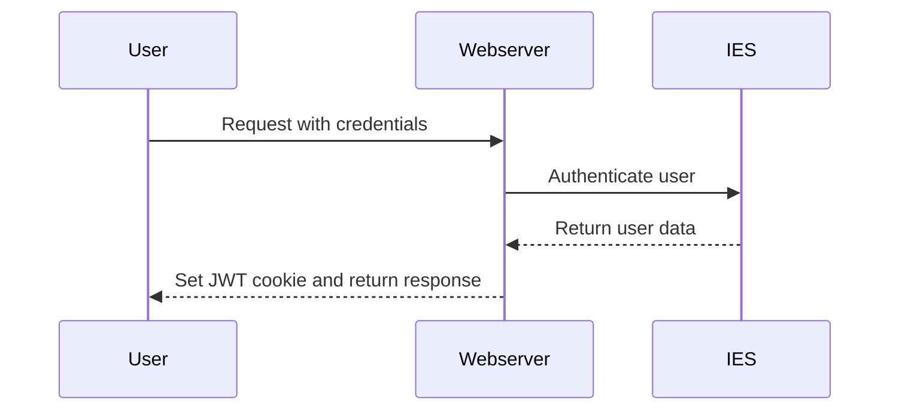

# WebAccount

The WebAccount is a central user account with which users can register and log in to a website. It is used for identification, authorization and personalization within a site.

## Use cases

**Registration & login**: Users can register themselves or be invited by administrators. After registration, extended functions are available.

**Personalized access**: Content and functions of the website are activated individually depending on the authorization level (e.g. only for logged-in users or certain groups).

**Access-restricted areas**: Used for extranet solutions, among other things.

**External content management**: External users can use their WebAccount to maintain events, for example, without requiring internal access to the system administration.

## Authentication

WebAccount users are managed in the IES. If a user wants to authenticate themselves, a request is sent to the web server. The web server does not receive the request and in turn sends a request to the IES to carry out the authentication. The IES checks the access data and returns the user data if authentication is successful. A JWT token containing the user data is then generated on the web server side. This token is stored in a cookie and used for future requests to identify and authenticate the user.

Currently, authentication is only possible via user name and password. Other authentication mechanisms are conceivable and can be implemented depending on the project requirements.

Already implemented authentication mechanisms are:

- **LDAP authentication via the IES**: The IES does not check the user name and password against its user administration but transfers the access data to an LDAP system which carries out the authentication.

Other possible implementations would be:

- **Authentication mechanisms via the IES**: The IES can support various authentication mechanisms.

      - **Username and password authentication with 2FA**: This is an addition to the existing authentication mechanism in which the IES supports two-factor authentication (2FA). The user enters their username and password and must also enter a confirmation code (`TOTP` - Time-based One-Time Password), which is generated via an authentication app.

      - **OpenID Connect via the IES**: OpenID Connect authentication can be set up in the IES, which makes it possible to log in via external identity providers. The IES acts as an OpenID Connect client and forwards the authentication requests to the respective provider. Two scenarios are conceivable for the possible role assignments:

          - **Claims mapping**: Here, the user's claims, which are provided by the external identity provider, are mapped to the roles and authorizations in the IES. This enables fine-grained access control based on the user attributes. In this scenario, it is not necessary for the IES to create the users in the system, as authentication takes place directly via the external identity provider.

          - **Role assignment in the IES**: In this scenario, the roles and authorizations are assigned manually in the IES. The IES receives the authentication information from the external identity provider and assigns the corresponding roles based on the rules defined in the IES. This enables central management of user roles and authorizations in the IES, independent of the external identity providers. In this scenario, it is necessary for the IES to create the users in the system, as authentication takes place directly via the external identity provider.

      - **WebAuthn (Passkeys)**: WebAuthn is an open standard for authentication that allows users to log in securely and user-friendly with biometric data or hardware tokens. The IES can support WebAuthn to provide a modern and secure authentication method.

- **Authentication mechanisms directly in the web server** It is possible for the web server itself to support various authentication mechanisms and therefore not be dependent on the IES. The prerequisite for this is that the authentication provider is accessible from the web server and can return the user data with the authentication. Possibly also data that can be used for role mapping.

      - **LDAP authentication**: The web server performs authentication directly against an LDAP directory. Role assignments must be made via mapping using the attributes or groups returned by the LDAP server.

      - **OAuth2/OpenID Connect**: The web server can use OpenID Connect to authenticate users via external identity providers. Role assignments must be made via claims mapping.
