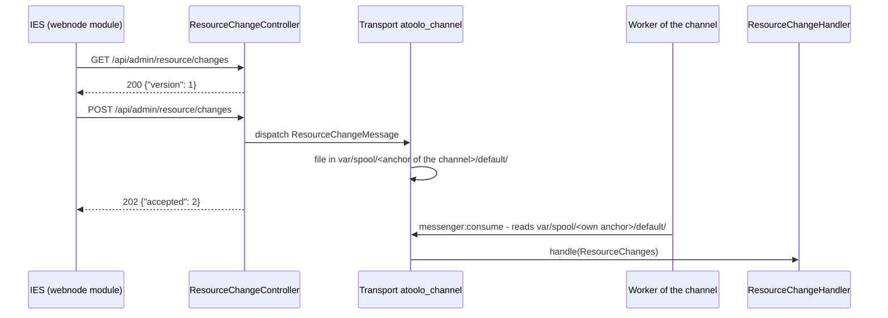

# Resource Bundle

In the Atoolo context, resources from IES are aggregated data that can be handled through this library.

There can be different formats in which the resource is aggregated by the CMS. The current format is the `SiteKit` format. Here, a PHP file is created for each article in which the data is stored in the form of PHP arrays. The data is read out via the corresponding `ResourceLoader` and made available in a `Resource` object.

These resources created by the IES are referred to as "internal" resources. The term "external" resources is used when the resource object is filled with data that does not originate from the IES.

## Sources

The sources can be accessed via the GibHub project [https://github.com/sitepark/atoolo-resource-bundle](https://github.com/sitepark/atoolo-resource-bundle){:target="\_blank"}.

## Installation

First add the Sitepark Flex Repository before installing the bundle.

See: [Sitepark Flex Repository](../symfony-flex-integration.md#sitepark-flex-repository)

Use [Composer](https://getcomposer.org/){:target="\_blank"} to install this component in your PHP project:

```sh
composer require atoolo/resource-bundle
```

## The Resource

The resource represents a data object published by the IES. This can be an article but also other objects that can be published by CMS.

See [Resource](../../concepts/resource.md) for more information.

The data is held in a `DataBag`, via which it can be read in a typed form. A string with dot notation can be used to retrieve more deeply nested data.

For a given data structure:

```json
{
  "id": 1,
  "name": "name",
  "groupPath": [
    {
      "id": 123,
      "name": "A"
    },
    {
      "id": 456,
      "name": "B"
    }
  ],
  "base": {
    "teaser": {
      "date": 1713516141,
      "headline": "Headline",
      "text": "Text"
    }
  }
}
```

The data can be queried as follows, for example.

- `$resource->data->getInt('base.teaser.date')`
- `$resource->data->getString('base.teaser.headline', 'Untitled')`
- `$resource->data->getArray('groupPath')`
- `$resource->data->getAssociativeArray('base.teaser')`

## Loading a resource

Resources are loaded via a `ResourceLoader`. Depending on the format in which the data is aggregated, a corresponding ResourceLoader must be used. The current format is the `SiteKit` format. The `Atoolo\Resource\Loader\SiteKitLoader` is available for this. The `SiteKitLoader` also requires a `ResourceChannel`.

### `ResourceChannel`

The IES recognizes various channels through which resources can be published. A channel is a directory that is always assigned to a specific virtual host.

See [Resource channel](../../concepts/resource-channel.md) for more information.

A `ResourceChannel` can be created via a `ResourceChannelFactory`.

```php
$resourceChannel = $resourceChannelFactory->create();
```

#### `ResourceChannelFactory`

The `ResourceChannelFactory` is an interface. The only implemented class is the `SiteKitResourceChannelFactory`.

```php
use Atoolo\Resource\SiteKitResourceChannelFactory;

$resourceChannelFactory = new SiteKitResourceChannelFactory($resourceRoot);
$resourceChannel = $resourceChannelFactory->create();
```

### `SiteKitLoader`

The `ResourceChannel` can be used to create the `SiteKitLoader`.

```php
use Atoolo\Resource\Loader\SiteKitLoader;
use Atoolo\Resource\ResourceLocation;

$loader = new SiteKitLoader($resourceChannel);
```

Resources can now be loaded.

```php
$location = ResourceLocation::of ('/index.php');
$resource = $loader->load(location);
```

### `CachedResourceLoader`

The `CachedResourceLoader` class is used to load resources from a given location and cache them for future use. The cache is stored in memory and is not persistent. The `CachedResourceLoader` wrapped another `ResourceLoader` and caches the resources loaded by the wrapped loader.

```php
use Atoolo\Resource\Loader\CachedResourceLoader;
use Atoolo\Resource\ResourceLocation;

$cachedloader = new CachedResourceLoader($loader);
$location = ResourceLocation::of('/index.php');
$resource = $cachedloader->load($location);
```

## Loading resource hierarchy

Resources can be linked to each other hierarchically. This is the case, for example, via the navigation. Here the root element is the homepage. Category resources are another case. Categories can also be structured hierarchically. These hierarchies can be read out with the `ResourceHierarchyLoader`.

There is a special case for navigation. Here, every resource (except the homepage) has a navigation parent. If no parent is explicitly defined, the current directory and all higher-level directories are searched for an `index.php` and checked to see if it is the homepage. If it is found, this is the implicit parent for the resource. Therefore, there is a special `SiteKitNavigationHierarchyLoader` for the navigation. The `SiteKitResourceHierarchyLoader` is used for all other cases.

`ResourceHierarchyLoader` also require a `ResourceLoader` (see above).

Create `SiteKitNavigationHierarchyLoader`:

```php
$hierarchyLoader = new SiteKitNavigationHierarchyLoader($loader);
```

or create a `SiteKitResourceHierarchyLoader`. The name of the hierarachy type is still required here. In this case for categories.

```php
$hierarchyLoader = new SiteKitResourceHierarchyLoader($loader, 'category');
```

Once the hierarchy loader has been created, the hierarchies can be queried. For example to load the root.

```php
$location = ResourceLocation::of('/a/b/c.php');
$rootResource = $hierarchyLoader->loadRoot($location');
```

## P Parameter Service

The `Atoolo\Resource\Service\PParameterService` (`atoolo_resource.p_parameter_service`) can be used to generate **P parameters** with foreign parent.

For more information, see [P parameter with foreign parent](../../concepts/navigation.md#p-parameter-with-foreign-parent).

```php
$pParameter = $pParameterService->getPParameterForForeignParent(
  ResourceLocation::ofPath('/culture/event-search.php'),
  ResourceLocation::ofPath('/service/events-calendar/some-event'),
);
```

## Using Symfony parameter and services

The bundle defines the parameter `atoolo_resource.resource_root` which is used to determine.

```yaml
parameters:
  atoolo_resource.resource_root: "%env(RESOURCE_ROOT)%"
```

If the environment variable `RESOURCE_ROOT` is not set, the `Atoolo\Resource\Env\EnvVarLoader` intervenes. This can determine the resource root for command line calls via the path of the `bin/console` script if the script was called via the host path. Like e.g.

```sh
/var/www/example.com/www/app/bin/console
```

The bundle provides the corresponding classes via service IDs. These can be used in a Symfony project via dependency injection.

| <div style="width:12em">Service-Id</div>      | Description                                      |
| --------------------------------------------- | ------------------------------------------------ |
| `atoolo_resource.resource_channel`            | The `ResourceChannel`                            |
| `atoolo_resource.resource_loader`             | currently the `SiteKitLoader`                    |
| `atoolo_resource.navigation_hierarchy_loader` | currently the `SiteKitNavigationHierarchyLoader` |
| `atoolo_resource.category_hierarchy_loader`   | currently the `SiteKitResourceHierarchyLoader`   |

## Using ResourceHierarchyWalker

The `ResourceHierarchyWalker` class is used to traverse a hierarchy of resources.
The walker needs a base resource to start with. This can be set with `init()`.

The walker can then be moved up and down in the hierarchy
with the help of methods like

- `down()`
- `child()`
- `up()`
- `nextSibling()`
- `previousSibling()`
- `next()`

With these methods, the walker can only move below the base resource.
To move above the base resource, the methods `primaryParent()`
and `parent()` can be used.

The walker can also be used to traverse the entire hierarchy
with the help of the `walk()` method.

```php
use Atoolo\Resource\ResourceHierarchyWalker;

$walker = new ResourceHierarchyWalker($hierarchyLoader);

// step by step
$location = ResourceLocation::of('/index.php');
$walker->init($location);
$walker->down();
$walker->nextSibling();
$walker->next();
// ...

// walk through the hierarchy
$walker->walk($location, function ($resource) {
  // do something with the resource
});
```

## Using ResourceHierarchyFinder

The `ResourceHierarchyFinder` class is used to find a resource in a hierarchy. Use `findFirst()` to find the first resource that matches the given condition.

```php
use Atoolo\Resource\ResourceHierarchyFinder;

$finder = new ResourceHierarchyFinder($this->loader);
$anchor = "anchor-to-find";
$location = ResourceLocation::of('/index.php');
$resource = $finder->findFirst(
    $location,
    function ($resource) use ($anchor) {
        $resourceAnchor =
            $resource->getData()->getString('anchor');
        return $resourceAnchor === $anchor;
    }
);
```

## Resource change notification

The CMS tells the website which resources it has published, changed or
depublished. The website reacts to it through handlers - the indexers of the
[Index Bundle](index-bundle.md) bring the changes into the Solr index and into
a GenAI application, for example.



### The endpoint

| Request | Answer |
| --- | --- |
| `GET /api/admin/resource/changes` | `200 {"version": 1}` - the CMS asks for it to learn whether the website accepts notifications |
| `POST /api/admin/resource/changes` | `202 {"accepted": <n>}`, `400` if the body is invalid |

```json
{
  "changed": [
    { "id": "1234", "path": "/news/foo.php" },
    { "id": "1234", "path": "/news/foo.php.translations/en_US.php" }
  ],
  "removed": [{ "id": "5678" }]
}
```

- `changed` names the published files, a translation by its own file.
- `removed` names the resources that are no longer published or must not be
  found - in all their languages.

The endpoint lies below `/api/admin/`, so it requires a JWT of a user with
`ROLE_ADMIN` or `ROLE_API` (see [Security Bundle](security.md)). The IES logs
in as the user `api` with the password of the webnode.

The route is imported by the recipe of the bundle. Symfony Flex applies a
recipe only when a package is installed, so a project that installed the bundle
before has to install the recipe itself. `cache:clear` - and with it every
`composer install` and `update` - points this out as long as the route is
missing:

```sh
composer recipes:install atoolo/resource-bundle --force -v
```

This creates `config/routes/resource.yaml`:

```yaml
controller:
  resource: "@AtooloResourceBundle/Controller/"
  type: attribute
```

### Asynchronous handling

The controller only dispatches a `ResourceChangeMessage` and answers at once.
The CMS sends the notification to the host of the channel, and every host is
mapped to exactly one channel. So the message goes to the spool of the channel
of the request, see
[Asynchronous messages per channel](#asynchronous-messages-per-channel), and
the worker of that channel hands the changes to every handler, one
notification after the other in the order they arrived.

- If a handler throws, the message is repeated - up to five times, with a
  growing delay - and all handlers get it again. After that it is moved to the
  transport `atoolo_channel_failed`.
- A handler that cannot handle the changes yet throws a
  `ResourceChangeDeferredException`. The message is then repeated every minute
  as long as it takes, without counting as a failed attempt. The indexers do so
  while a full index run is in progress.

### Custom handler

A handler implements `ResourceChangeHandler` and is registered through
autoconfiguration. It has to be idempotent, since it may see the same changes
more than once.

```php
use Atoolo\Resource\Change\ResourceChangeHandler;
use Atoolo\Resource\Change\ResourceChanges;

class CacheInvalidator implements ResourceChangeHandler
{
    public function handle(ResourceChanges $changes): void
    {
        foreach ($changes->changedPaths() as $path) {
            // invalidate the cache of the path
        }
        foreach ($changes->removedIds as $id) {
            // invalidate the cache of the resource
        }
    }
}
```

## Asynchronous messages per channel

A website has no message broker, and one application often serves several
channels - `www` and `preview` of a host, for example. The bundle therefore
brings a [Messenger](https://symfony.com/doc/current/messenger.html){:target="\_blank"}
transport that keeps messages as files, apart for each channel:

```
var/spool/<anchor>/default/   pending messages of the channel
var/spool/<anchor>/failed/    messages that failed too often
```

| Transport | DSN | Purpose |
| --- | --- | --- |
| `atoolo_channel` | `atoolo-channel://default` | messages for the worker of a channel, 5 retries with a growing delay |
| `atoolo_channel_failed` | `atoolo-channel://failed` | failure transport of `atoolo_channel` |

Both are registered by the bundle, a project needs no messenger configuration
of its own.

- **Sending:** a message belongs to the channel of the `ChannelStamp` it is
  dispatched with, otherwise to the channel of the sending process.
- **Receiving:** a worker reads only the spool of its own channel. It knows the
  channel from the path `bin/console` is called by, see
  [Worker](../../operate/worker.md).

Any bundle can hand its messages to the worker of a channel. It routes them to
`atoolo_channel` - in the `prependExtension()` of its bundle class or with the
`#[AsMessage]` attribute - and dispatches them as usual:

```php
use Atoolo\Resource\Messenger\ChannelStamp;
use Symfony\Component\Messenger\Attribute\AsMessage;

#[AsMessage('atoolo_channel')]
final class RebuildSitemap
{
}

// the channel of the current process
$bus->dispatch(new RebuildSitemap());

// another channel
$bus->dispatch(new RebuildSitemap(), [new ChannelStamp('preview')]);
```

A worker claims a message before it handles it, so several workers of one
channel never handle the same message. A claim of a worker that died is
released after an hour.

